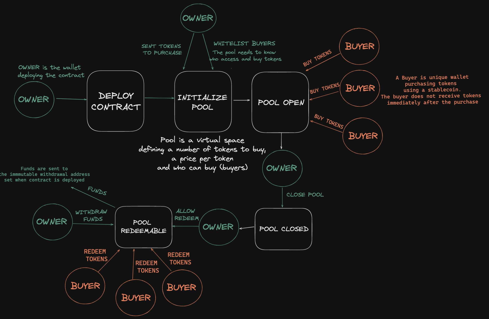
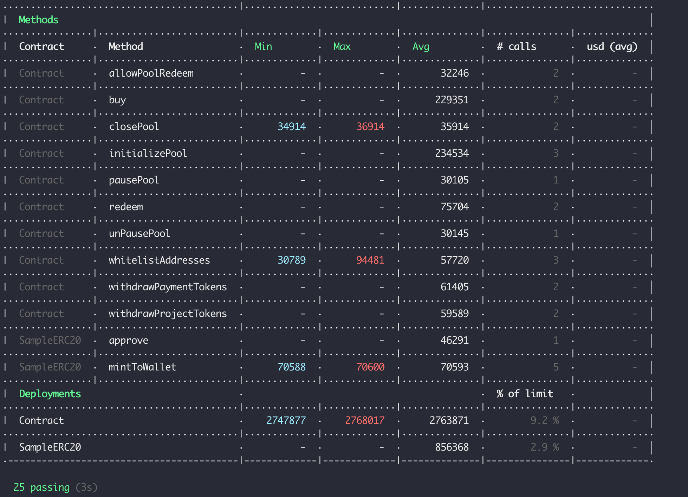
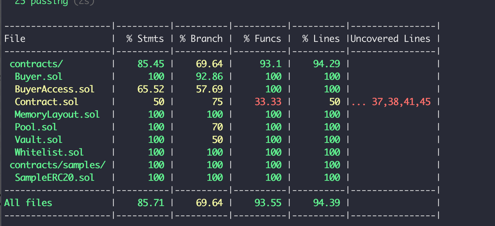

# Fundraising Contract

A complete Solidity contract for IDO (initial dex offering) / INO (initial NFT offering) / IGO (initial game offering), and so on. This repo contains the new (under-dev) version of our funding-raising contract.

## At a glance



## Features

✔️ Multi-pool  
✔️ Whitelist per pool  
✔️ Vesting supported  
✔️ Multiple buy feature  
✔️ Raise funds with a stablecoin  
✔️ Raise funds with or without tokens!  
✔️ Clean code and great documentation  
✔️ Script ready to deploy  
✔️ Multi chain supported

## Configuration

Rename `.env.example` to `.env` and add your private key for your favorite blockchain.

### hardhat.config.ts

We've already added public node URLs for Binance Smart Chain and Polygon.
We recommend using Moralis to get a free node and deploy it on Ethereum or Avalanche. Please see [here](https://docs.moralis.io/speedy-nodes/connecting-to-rpc-nodes/connect-to-eth-node).

## Contract configuration

Set up your contract configuration with `setup.json` located in `scripts` folder.

**Please make sure to complete setup.json before you run the deploy command**

```json
{
  "paymentToken": {
    "contractAddress": "",
    "decimals": 18
  },
  "projectToken": {
    "contractAddress": "",
    "decimals": 18
  },
  "withdrawFundsAddress": "",
  "vestingPercentage": 100,
  "pools": [
    {
      "poolId": 1,
      "openTime": "2022-01-01T00:00:00.000Z",
      "totalProjectToken": 1000,
      "paymentTokenAllocation": 100,
      "tokenPrice": 1,
      "tokensForPrice": 1
    }
  ]
}
```

### paymentToken

paymentToken is the stablecoin you wish to use for your fundraising. Fill in the correct contract address and the number of decimals this contract supports ERC20.

### projectToken

projectToken is the token you wish to raise funds for. Fill the correct contract address and the number of decimals this ERC20 contract supports.

If the token does not exist yet, you can simply put `0x0000000000000000000000000000000000000000` address and use the same number of decimals as paymentToken

### withdrawFundsAddress

This should be the address where funds are sent after the fundraising.

For security purposes, we are not sending funds to the owner. If the owner's private key gets comprised, funds will be safe. Of course, we recommend using a different address than the owner's address.

### vestingPercentage

vestingPercentage is use to calculate the number of tokens bought the buyer is allowed to receive after the fundraising through the `redeem` feature.

For example, let's say vestingPercentage = 20%.

If the token price is 1$ and the buyer fund 100 dollars worth of tokens, he will redeem 20 tokens.
Put "100" if the buyer can receive all of his tokens.

### Pools

#### poolId

Must be the unique identifier of your pool.

#### openTime

Must be the time when open the pool. it should be using the DateTime Format. (YYY-MM-DDTHH:mm:ss.sssZ)

#### totalProjectToken

Must be the number of tokens available to purchase.

**Do not take into consideration the vesting. The full purchasable amount must be indicated**

#### tokenPrice

If tokenPrice is 0.01$, then token price should be 1

#### tokenForPrice

If tokenPrice is 0.01$, then tokensForPrice should be 100. (1 / 100 = 0.01$)

## Deploy your contract

```javascript
// Binance Smart chain
// mainnet
npm run deploy:bsc:mainnet
// testnet
npm run deploy:bsc:testnet

// ETHEREUM
// mainnet
npm run deploy:eth:mainnet
// testnet
npm run deploy:eth:testnet

// Avalanche
// mainnet
npm run deploy:avax:mainnet
// testnet
npm run deploy:avax:testnet

// Polygon
// mainnet
npm run deploy:matic:mainnet
// testnet
npm run deploy:matic:testnet
```

## Whitelist

This fundraising contract works with a whitelist. Your users must be on the whitelist to access the fundraising.

You must be calling the `whitelistAddresses` from your favorite UI (Defender, Remix, ..) or custom script.

```solidity
function whitelistAddresses(
   address[] memory _addrs,
   uint8 _tickets,
   uint8 _poolId
) external onlyOwner
```

Example:

```solidity
whitelistAddresses(['0x70A78123250635DD66b081D029B5e65F8c5EDB42'], 1, 1);
```

The number of tickets will be multiplied by the `paymentTokenAllocation` and the result will be the maximum allocation the user can fund.

This contract has a `multiple buy feature`, meaning the user can send multiple `buy` transactions until he reaches his max allocation.

## Tests

```shell
npm run test
```

## Etherscan verification

Make sure to enter your Etherscan API key in your `.env` file

copy the deployment address and paste it in to replace `DEPLOYED_CONTRACT_ADDRESS` in this command:

```shell
npx hardhat verify --network bscMainnet DEPLOYED_CONTRACT_ADDRESS
```

## Testing

to run tests run

```shell
npx hardhat test
```



to get coverage run

```
npx hardhat coverage
```



## Security

This new contract is not officially audited and verified; however, we considered taking best security practices and used vetted libs like openzeppelin whenever possible. We tested our smart contract using the most actively developed related tools, namely Mythril and Slither, which reported zero security issues.

please contact **security [at] equinox.fund** if you believe you've found a security vulnerability.
